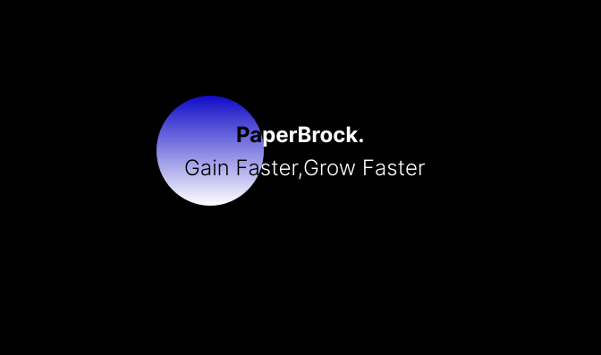

<h3>PaperBrock</h3>

<b>PaperBrock is Saas app to make exam preparation easier.</b>

👉PaperBrock mainly focus on maximum utilizing exam resources.analayze,abstract,append<b>.</b>

👉PaparBrock provides robest tools to make their student's preparation more effective and time efficient<b>.</b>

<h3>PaperBrock Provied features like...</h3>
<ul>
<li>PYQ analayzer</li>
<li>Answer book generator</li>
<li>Practice paper generator</li>
<li>Community Support etc.</li>
</ul>

<h3>PaperBrock Fundamental Tech Stack</h3>
<ul>
<li>Mongo Database</li>
<li>React JS(frontend)</li>
<li>Node JS(Backend)</li>
<li>Tailwind CSS(UI)</li>
</ul>